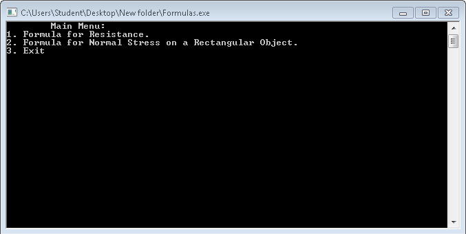
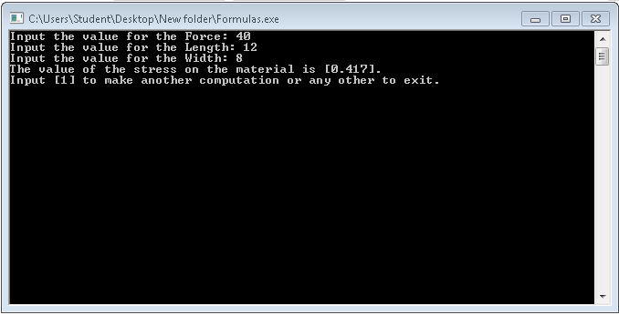
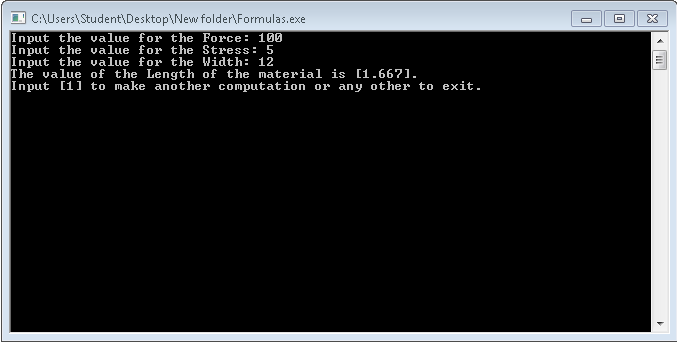
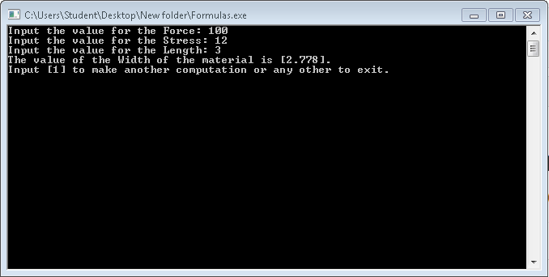
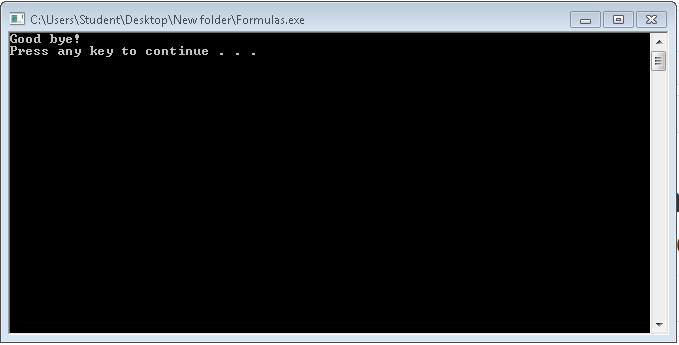

# lbyec72-ei2-prelimactivitynumber2-donotincludeanycode-DavidRenes
<h2>Main Menu</h2>

<h2>Formula 1</h2>

<h2>Resistance</h2>

<h2>Area</h2>

<h2>Length</h2>

<h2>Resistivity</h2>

<h2>Formula 2</h2>

<h2>Stress</h2>

<h2>Force</h2>

<h2>Length</h2>

<h2>Width</h2>

<h2>Exit</h2>

<h2>Error</h2>

